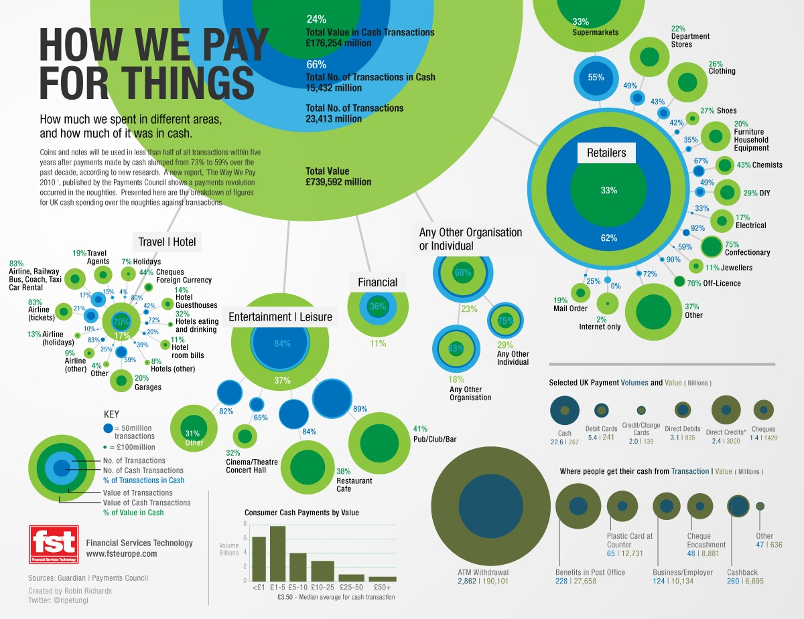
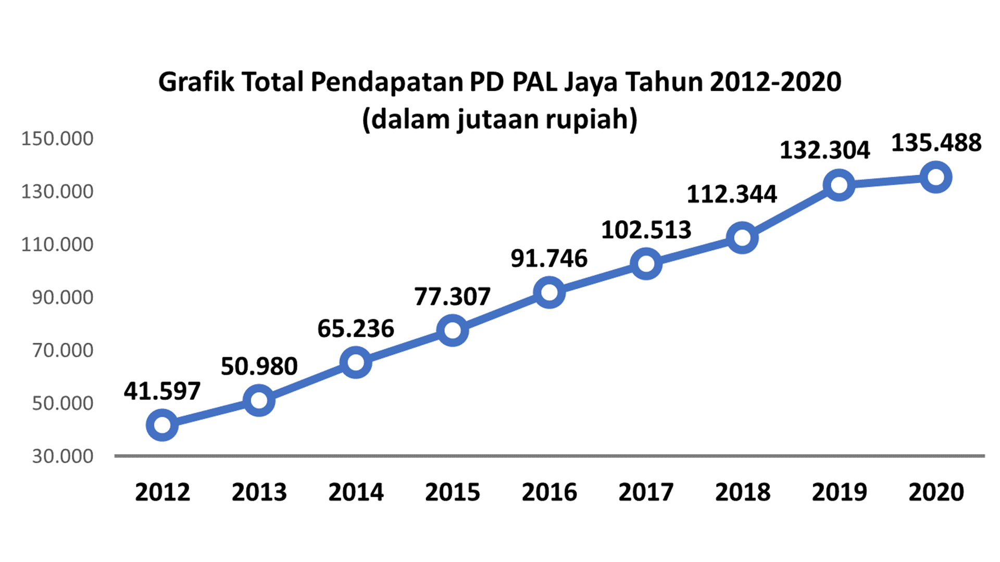
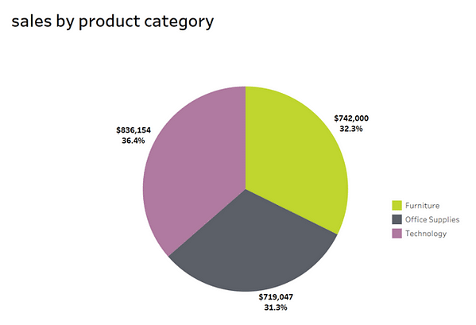

Contoh Visualisasi Baik

1. Strive for Forms and Functions:
Gambar ini menggunakan bentuk lingkaran untuk mewakili volume transaksi dan nilai transaksi, dengan variasi ukuran yang membuatnya sangat mudah dibaca. Bentuk dan fungsi dipadukan untuk memperjelas data misalnya, ukuran lingkaran semakin besar untuk kategori dengan jumlah transaksi lebih tinggi.
Desain ini menunjukkan bahwa bentuk-bentuk (lingkaran) yang digunakan berfungsi untuk memudahkan perbandingan visual, sehingga pengguna langsung dapat membedakan volume dan nilai dari transaksi tertentu.
2. Justifying the Selection of Everything We Do:
Setiap elemen yang ditampilkan di dalam visualisasi ini memiliki alasan yang jelas. Pemilihan ukuran lingkaran, warna, dan lokasi semuanya menginformasikan elemen tertentu (seperti nilai transaksi, jumlah transaksi tunai, dll.), yang berarti setiap elemen visual didasarkan pada data nyata, bukan dekorasi. Warna hijau digunakan untuk menggambarkan pembayaran dengan uang tunai, sedangkan biru menunjukkan transaksi non-tunai.
3. Creating Accessibility Through Intuitive Design:
Desain ini cukup intuitif karena ukuran lingkaran besar untuk kategori transaksi yang lebih besar, dan perbedaan warna membuatnya mudah untuk membedakan antara jenis pembayaran. Penggunaan warna yang konsisten dengan legenda di bagian bawah mempermudah pengguna dalam memahami hubungan antar data.
Ikon lingkaran yang berbeda juga memudahkan pengguna untuk melihat informasi yang lebih spesifik, seperti pembagian kategori antara "retailers", "financial", "entertainment", dan sebagainya.

1. Strive for forms and functions: Grafik ini mengikuti prinsip ini dengan menggunakan bentuk yang sederhana (garis dengan titik data) yang sesuai untuk menunjukkan tren data keuangan. Fungsi utama grafik adalah menunjukkan kenaikan pendapatan secara jelas dari tahun 2012 hingga 2020.

2. Justifying the selection of everything we do: Setiap elemen pada grafik, seperti penanda data, label angka, dan tahun, dipilih secara relevan untuk memperkuat pemahaman tren tanpa menambahkan elemen yang tidak perlu.

3. Creating accessibility through intuitive design: Grafik ini cukup intuitif karena menyajikan data dengan jelas menggunakan garis tren yang umum dikenal. Pembaca dapat dengan mudah melihat perkembangan setiap tahun berdasarkan angka yang ditampilkan.

4. Never deceive the receiver: Grafik ini tidak menyesatkan. Skala pada sumbu y proporsional, dan perubahan pendapatan dari tahun ke tahun ditunjukkan secara akurat tanpa ada distorsi visual.

Contoh Visualisasi Buruk
.png)

1. Strive for forms and function. Bentuk visualisasi ini tidak ideal karena penempatan kategori Furniture, Office Supplies, dan Technology di setiap wilayah tampak serupa dan tidak memudahkan perbandingan yang jelas. Selain itu, ada bar yang terbalik atau memanjang ke bawah yang bisa membingungkan pembaca. Bentuk yang digunakan tidak maksimal dalam mendukung fungsi perbandingan data.

2. Justifying the selection of everything we do. Pemilihan elemen visual (seperti bar yang memanjang ke arah yang berbeda) bukanlah visualisasi yang benar. Bar chart seharusnya digunakan untuk memperjelas perbandingan vertikal, tetapi beberapa bar di sini memanjang ke bawah tanpa alasan yang jelas, sehingga sulit memahami tujuan dari desain ini.

3. Creating accessibility through intuitive design. Desain ini tidak intuitif karena pembaca akan bingung dengan arah bar yang berbeda-beda. Warna yang digunakan memang membedakan kategori, tetapi tidak membantu dalam memahami hubungan antar data secara cepat. Selain itu, skala tidak dijelaskan dengan jelas dan bisa membuat data sulit diakses.

Data di atas sebaiknya dibuat dalam visualisasi secara horizontal agar terlihar perbedaan antara variabel dari barplot yang dihasilkan

1. Strive for forms and functions. Pie chart tidak selalu merupakan pilihan terbaik untuk membandingkan data, terutama saat perbedaan antar-segmen tidak begitu besar. Di sini, perbedaan antar-segmen (32.3%, 31.3%, dan 36.4%) sangat kecil, membuat perbandingan antar-kategori sulit dilakukan dengan cepat. Dalam hal ini, bar chart atau visualisasi lain yang lebih linear mungkin lebih efektif untuk menggambarkan perbedaan penjualan.

2. Justifying the selection of everything we do. Pemilihan pie chart untuk menggambarkan data dengan persentase yang mirip tidak terlalu tepat. Meskipun pie chart umum digunakan untuk memperlihatkan pembagian persentase, elemen visual ini tidak mempermudah pemahaman yang cepat, terutama ketika segmen hampir berukuran sama.

3. Creating accessibility through intuitive design. Desain ini kurang intuitif karena sulit membedakan dengan jelas antar-segmen yang hanya berbeda beberapa persen. Pie chart seringkali efektif jika terdapat perbedaan yang signifikan antar-segmen, namun di sini, segmen yang hampir seimbang membuat visualisasi sulit diakses secara cepat.

Data di atas sebaiknya divisualisasikan dengan menggunakan bar chart agar perbedaan antara variabel dengan persentase perbandingan yang kecil dapat terlihat